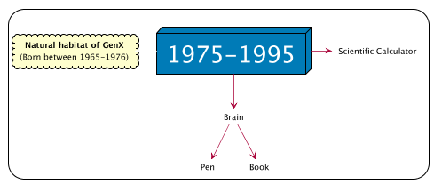
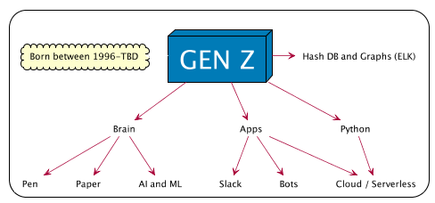

One of the frequent comments I get when talking about the topics in this book is _"I like the concepts but I'm not a developer/programmer!"_, implying that they don't have to learn how to code in order to be effective professionals in their area. Given the impact of technology of all parts of society and industries (after all, ['Every company is a technology company'](https://blogs.thomsonreuters.com/answerson/all-companies-are-technology-companies-now/) these [ days](https://www.forbes.com/sites/forbestechcouncil/2017/01/23/why-every-company-is-a-technology-company/)) this is a very career limiting move, and even more worryingly, it is limiting

This means that all professionals need to know how to code, more specifically the ones in _STEM_ (Science, Technology, Engineering and Maths) sector.

### Mapping the tech stack per generation

In order to represent the evolution of the tech stack (or toolkit), I decided to map out which technologies where used by era and Generation

The use of Tech Stack is borrowed from the software development process where it represents a [_combination of programming languages, tools and frameworks that the developers use to create web and mobile applications_](https://hackernoon.com/how-to-pick-the-right-web-technology-stack-for-your-product-f6d94440af2f)

### Gen X

Here are the main components

- Brain
- Pen
- Paper
- Scientific Calculator

### Gen Y

- **Brain**:
- **Pen and Paper**: ...
- **~~Scientific Calculator~~**: ...
- **Spreadsheets**: ...
- **Computer**: ...
- **Mobile**: ...
- **Internet**: ...
- **Email**: ...
- **Data Center**: ...

### Gen Z

- **Brain**: ...
- **Pen and Paper**: ...
- **AI and LM**: AI (Artificial Intelligence) and ML (Machine Learning) ...
- **~~Scientific Calculator~~**: ...
- **~~Spreadsheets~~**: ...
- **~~Computer~~ and ~~Mobile~~**: ... merge and eventually disappear
- **~~Internet~~**: ... disappears since it becomes a commodity where everything is connected to it
- **~~Email~~**: ...
- **~~Data Center~~**: ...

(to add to diagram)
- **voice**
